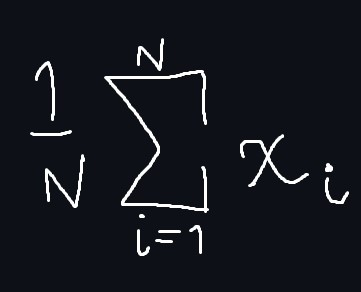
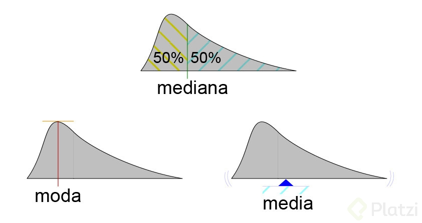

# Math-Data-Science

En estas notas haremos entender el concepto de Estadística Descriptiva

## Estadística descriptiva vs. inferencial

Hablemos de DEPORTES.

Tomando un jugador de futbol por ejemplo, cuando ves sus **Estadisticas** deportivas esos numeros nos quantifican el desempeño de dicho jugador despues de muchos partidos y todos los datos de cada uno de los partidos, despues de cierta cantidad de tiempo quedaría una base de datos del metricas del jugador lo suficientemente grande como para crear metricas resumidas para entender de forma sencilla corta y concreta el desempeño del jugardor sin tener que ver todos y cada uno de los partidos de el jugador

Ahí entendemos el punto fundamental de la estadistica , la **Descriptiva** la cual se basa en:
***RESUMIR***

Por otro lado la Estadistica Inferencial se enfoca mas en la parte de predecir el futuro en datos que ya tenemos disponibles, usando el ejemplo del jugador de futbol de nuevo la estadistica inferecial se enfocaria en predecir como será el desempenho de dicho jugador en proximos partidos


Es esa grafica podemos ver como comparan el desempeño de varios jugadores de futbol, nos interesa ver cada uno de los jugadores esta categorizado por varios metricas, n° de partidos jugados, n° de minutos jugados, n° de goles, n° de asistencias, etc apartir de estos numero podemos sacar un unico numero que ellos llamaron Rating

Hay cosas buenas y malas con esto, porque resulta que podemos mentir con este tipo de estadisticas, la estadistica descriptiva apesar de ser una rama de las matematicas, tiene un problema de raiz, que es lo siguiente

**¿Como yo defino que algo es correcto o no?**

En este cas, ¿como defino un metrica unica que defina cual es el mejor jugador?, no existe verdad?´

Pues porque la definicion de "el mejor jugador" puede ser diferente para diferentes personas, por ejemplo hay personas que podrian decir que para ellas el mejor jugador es que hace mas asistencias porque es el estratega, el que se pasa a los defensa y luego hace un pase estrategica que terminaria eventualmente haciendo el gol ,pero para otras podrian decir que el mejor jugador es el que hace mas goles por al final del dia los goles son los que ganan los partidos, etc

Ahora, quien tiene la razon; **AMBOS**

Ambas son metricas validas, solo que cada una de esas metricas de mostratá diferentes lados de una misma moneda, y esto nos da la posibilidad de mentir


**¿Por qué aprender estadística?**

- Resumir grandes cantidades de información. 
- Tomar mejores decisiones (¿o peores?). 
- Responder preguntas con relevancia social. 
- Reconocer patrones en los datos.
- Descubrir a quienes usan estas herramientas con fines nefastos.

## Flujo de trabajo en Data Science


En la imagen anterior te puedes percatar que hay una linea de cajas verdes que define el flujo de trabajo en data science leyendose de izquierda a derecha

## Medias de Tendencia Central

Imaginate un salon con estudiantes, estos tienen diferentes edades, y alguna persona te dice que "Oye, en ese salon la edad promedio de los estudiantes es de 7 años", Eso te puede dar varios pensamientos, como por ejemplo, Son estudiantes jovenes pero eso no quiere decir que todos estudiantes tengan 7 años, sino, que sus edades son mas o menos cercanas a 7 años

A lo queremos llegar con esto es a que las medidas de tendencia central son una manera de resumir informacion

Esto tiene sus desventajas y ventajas, puedes extraer informacion valiosa, como por ejemplo suponer que son estudiantes jovenes, la desventaja es, que pasa si hay estudiantes que son demasiado viejos o jovenes en ese salon, el promerio no puede dar informacion de eso, y crees que esos estudiantes estan afectando mi medida de promedio?

Hay que recordar que siempre que querramos "resumir informacion" estamos haciendo invisibles ciertos datos

### ¿Tendencia Central?

Existen tres medidas de tendencia central

- Media (promedio)

Esta tendencia tiene que ver con una nocion de centralidad de los datos, es resumo de los datos

- Mediana (dato central)

Este es el dato que esta en la mitad, a los dos lados tiene la misma cantidad de gatos

- Moda (dato mas repetido)

Este es simplemtente el dato que mas se repite

## Diagrama de frecuencias


Tenemos una lista de estudiantes, en este caso 20, con estos podemos considerar que son estudiantes mas viejos de 16, 17, 18 y queremos contar con la frecuencLa segunda tabla de frecuencias la construimos asi; la edad mas poequeña tienen 15 años y contar cuantos de ellos tienen 15 años, en este caso nos da 3 entonces en la tabla de frecuencias y asi con las otras edades
ia que se repite cada edad


Ahora, viendo ese diagrama de frecuencia podemos decir que la **Moda** es 18 años, eso es facil, pero ahora como hacemos con la media y la mediana?

### ¿Cuando usar cuál?

- La media es susceptible a varios atípicos.

Si tenemos un cojunto de personas todas tiene edades muy cercanas, la adicion de una persona con una edad mucho mayor, la medida resultante se va a ver fuertemente afectada por esa persona mayor, el ejemplo seria el mismo si es mas joven

- La moda no aplica para datos numéricos continuos

## Metáfora de Bill Gates en un bar


**_{X<sub>1</sub>, X<sub>2</sub>, X<sub>3</sub>, X<sub>4</sub>, ..., X<sub>n</sub>}_ DataSet**

Este dataset se un conjunto que tiene n elementos distintos, como edades, salarios, etc. Si quisiera sacar el promedio de ese dataset se hace de la siguiente manera:


La **Media** de este dataset se define como = X̅

Esta se calcula como sumar todos los valores del conjunto o Dataset, asi:

X<sub>1</sub>+ X<sub>2</sub>+ X<sub>3</sub>+ X<sub>4</sub>+ ...+ X<sub>n</sub>

Y luego el resultado de esa suma, la dividimos por la cantidad de datos, asi:

```bash
1/n
```

Tambien existe una forma contraria de escrivir esta suma



Esta formula en pocas palabras quiere decir que estoy recorriendo todos los valores de X (Nuestro dataset)

La **mediana** tiene algo peculiar, como queremos definir el dato central, tenemos que tomar en consideracion si la cantidad de datos de nuestro dataset es par o impar, porque si es par tendremos que tomar los dos datos que esten en el medio y si es impar tomaremos un unico dato del medio


Ahora imaginate un bar, donde hay 10 hombres bebiendo, cada unos de esos hombre tienen un salario, en este ejemplo supondremos que cada unos de estos sujetos tienen curiosamente el mismo salario que sera 35.000$ al año, ahora con estos datos ya podemos calcular el promedio, la media y la moda todos seria 35.000$

Podriamos decir que en ese bar el salario promedio de la personas que van en de 35000$ anuales

Pero, ahora llega Bill Gates y se sienta al lado de los 10 señores, supongas que el tiene un salario anual de 1.000.000$ 

Si ahora quisieramos calcular el salarios promedio de la personas de aquel bar los valores cambiarian mucho


El promedio sería ahora 122,727.27 $, o sea 87,727 más por una única persona muy alejada del promedio

Ahora la mediana, si agarramos los valores del medio (estando los salarios organizados) el valor será una aproximación más realista, ya que esta no está tan sesgada por valores atípicos como en ente caso el de Bill Gates



## Medidas de tendencia central PY


```python
import pandas as pd

df = pd.read_cvs('cars.csv')

```


 
  


